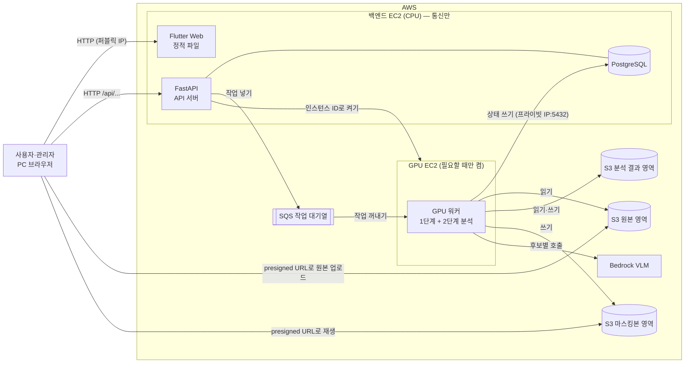

# 02. 시스템 아키텍처

> 마지막 수정: 2026-09-27
> 표시: 🚧 미정 · ⚠️ 확인 필요 · 🔐 멘토 승인 필요

## 2.1 한눈에 보기

- 인스턴스는 2대다. **백엔드 EC2(CPU)**는 웹, API, DB를 맡고, **GPU EC2**는 필요할 때만 켠다. (D-10)
- **영상 분석은 모두 GPU 워커가 한다.** 백엔드는 통신과 관리만 한다: API 응답, DB, 작업 넣기, GPU 켜기, presigned URL 발급. (D-14)
- 작업은 **SQS 대기열**로 전달하고, 작업 상태는 **DB(PostgreSQL)**에 기록한다. (D-16, D-17)
- GPU EC2는 **업로드 남은 예상 시간이 임계(기본 3분) 이하가 될 때** 켜고, **15분** 동안 할 일이 없으면 스스로 꺼진다. (D-62, D-15)
- 영상은 비공개 **S3**에 저장한다. 업로드와 재생 모두 presigned URL을 써서 S3와 직접 주고받는다. (D-09, D-18)
- 접촉 가능성 점수는 **Bedrock VLM** 두 단계(1차 탈락, 2차 점수)로 매긴다. Bedrock만 서울에서 교차 리전으로 부른다. (D-06, D-74)
- 분석은 **두 단계**로 나눈다. 1단계는 업로드 직후 정지 장면만 만들고, 영상 전체 분석은 사용자 입력 뒤 2단계에서 한다. 사용자가 기다리는 시간보다 탐지 성능을 우선한다. (D-05 → D-67)
- **분석은 원본, 열람은 마스킹본**(이중 경로)을 구조로 강제한다. (2.4)
- 사용자가 몰려도 서버가 멈추지 않도록 최소 조치를 하고, 처리 속도 확장은 방향만 적는다. (D-19, 2.12)

## 2.2 구성 요소

| 구성 요소 | 역할 | 실행 위치 | 담당 |
|---|---|---|---|
| 웹 프론트 | 화면. Flutter Web 빌드 결과(정적 파일) | 백엔드 EC2에서 서빙 (D-11) | 팀원 1 |
| API 서버 | 로그인, 업로드 URL 발급, 상태 조회, 입력 저장, 후보 제공, 사건 지점 고정, 작업 넣기, GPU EC2 켜기. **분석은 하지 않는다** (D-14) | 백엔드 EC2 | 팀원 2 |
| DB (PostgreSQL) | 사용자, 영상, 작업 상태, 입력값, 후보, 고정된 사건 지점 | 백엔드 EC2에 직접 설치 (D-17) | 팀원 2 |
| SQS 작업 대기열 | 백엔드가 넣은 작업을 GPU 워커에 전달한다. 대기열 1개이고 DLQ는 두지 않는다 (D-56) | AWS 관리형 (D-16) | 팀원 2(Terraform), 팀장(워커) |
| GPU 워커 | 1단계(정지 장면 비식별화), 2단계 전부(청크별 후보 탐지 채널 A·B, 0단계 필터, Bedrock 1차·2차 호출, 정렬, 상위 20개 후보 클립 크롭·비식별화), 다음 묶음 미리 준비, 15분 쉬면 스스로 끄기 (D-67, D-68) | GPU EC2 (D-14, D-15) | 팀장 |
| S3 | 원본 영상, 마스킹본, 분석 결과(트랙 등) 저장 | AWS 관리형 | 팀장(설계), 팀원 2(Terraform) |
| Bedrock | VLM 1차(탈락)·2차(점수). GPU 워커가 서울에서 교차 리전 추론 프로파일로 호출한다 | AWS 관리형 (D-06, D-74) | 팀장 |

## 2.3 구성도



- 사용자는 백엔드 EC2의 퍼블릭 IP로 접속한다. EIP를 쓰지 않으므로 인스턴스를 켤 때마다 주소가 바뀐다. (2.7)
- 프론트는 API를 상대경로(`/api/...`)로 호출한다. 주소가 바뀌어도 프론트와 API의 연결은 깨지지 않는다.
- 영상 트래픽은 백엔드 EC2를 거치지 않는다. 관리자는 원본을 presigned URL로 S3에 직접 올리고(D-18), 사용자는 마스킹본을 presigned URL로 S3에서 직접 재생한다(D-09). presigned URL은 일정 시간만 유효한 임시 주소다.
- 백엔드는 GPU 워커에 직접 요청하지 않는다. SQS에 작업을 넣을 뿐이다. 그래서 GPU EC2의 IP를 알 필요가 없다. (D-16)
- S3는 **비공개 버킷 3개**(원본·마스킹본·분석 결과)로 나눈다. 백엔드 EC2 역할에 원본 버킷 읽기 권한을 주지 않아 불변 조건 1을 IAM으로 강제한다. 버킷 수에는 요금이 없다. (D-23)

## 2.4 이중 경로와 불변 조건

PRD 3.1의 이중 경로를 구조로 강제한다.

| 경로 | 쓰는 데이터 | 누가 쓰나 |
|---|---|---|
| 분석 경로 | 원본 영상 | GPU 워커(객체탐지·추적, 룰, Bedrock 호출), Bedrock VLM |
| 열람 경로 | 마스킹본 (정지 장면, 후보 클립) | 사용자 브라우저 |

- 백엔드 EC2 역할은 원본 영역에 **쓰기(업로드 URL 발급)만**, 마스킹본 영역에 **읽기(재생 URL 발급)만** 가진다. 권한으로도 원본 재생 URL을 발급할 수 없게 막는다. (2.9)

**불변 조건**: 코드와 테스트는 아래 조건을 항상 만족해야 한다.

1. API 응답에 원본 영상의 S3 키나 재생 URL이 포함되지 않는다. 재생용 presigned URL은 마스킹본에만 발급한다. 원본에는 업로드용 URL만 발급한다.
2. 사용자에게 보여주는 모든 이미지·영상은 마스킹본이다. 비식별화가 끝나지 않은 장면은 보여주지 않는다.
3. 후보 선별과 VLM 점수는 원본 영상으로 수행한다.
4. VLM은 후보를 제거하지 않는다. 정렬 전후 후보 수가 같다. (PRD 3.4)
5. VLM 점수는 후보마다 따로 매긴다. 후보끼리 한 번에 비교하지 않는다. (PRD 3.4)
6. 사용자 화면에 접촉 여부 판정 결과를 표시하지 않는다. (PRD 3.4)
7. 후보는 원본 시간 기준 판정 시점을, 후보 클립은 원본 시간 기준 시작·끝을 가진다. 고정된 사건 지점은 가리키는 클립의 값을 쓴다. 청크 분할과 클립 가공 후에도 이 값이 유지된다. (PRD 3.6, D-33)
8. 영상 다운로드 기능(버튼·링크)을 제공하지 않는다. (PRD 3.6)
9. S3 버킷 3개는 **HTTP 접근을 거부한다.** 버킷 정책에 `aws:SecureTransport = false` Deny를 걸어, 영상이 평문으로 오갈 수 없게 한다 (D-55). 사이트 자체의 HTTPS와는 별개다 (D-31)

## 2.5 처리 흐름: 두 단계 분석

**사용자가 기다리는 시간보다 탐지 성능과 처리 속도를 우선한다.** 본인 차량 위치를 알아야 그 주변만 조밀하게 보고, 객체탐지 클래스에 없는 물체를 움직임으로 잡을 수 있다. 그래서 영상 전체 분석은 사용자 입력을 받은 **뒤에** 한다. 1단계는 입력에 필요한 정지 장면만 만든다. (D-05 → D-67. 단계별 세부는 [06장 6.1](06-pipeline.md#61-전체-흐름))

```
[업로드 시작]
관리자가 업로드 시작 → 백엔드: 업로드 URL 발급 (D-18). 이 요청은 GPU 켜기 신호가 아니다 (D-62)
                    → 업로드 남은 예상 시간 <= 임계(기본 3분)가 되면 브라우저가 켜기를 1회 요청 (D-62)
                    → 브라우저가 S3로 직접 업로드하는 동안 GPU 부팅·모델 로딩

[1단계: 업로드 완료 후 자동 실행 — 수십 초 (추정), GPU 워커]
업로드 완료 알림 → 백엔드가 1단계 작업을 SQS에 넣음
  코덱 검사 → 정지 장면(시작 장면 1장) 추출 → 차량 탐지 → 비식별화 → S3 마스킹본 영역

[사용자 입력 — 1단계 이후 아무 때나, 사용자가 원하는 장소에서]
정지 장면 확인 → 본인 차량 선택 + 탐지 상황(보임/안 보임) + 파손 부위
  + 파손 사진(선택) + 텍스트 설명(선택) → DB에 저장 (D-66, D-72)
→ 백엔드가 2단계 작업을 SQS에 넣고 GPU EC2 켜기를 요청

[2단계: 입력 저장 후 자동 실행 — 24시간 영상 약 30분 (추정), GPU 워커]
① 청크별 후보 탐지: 채널 A(객체탐지+추적) + 채널 B(근접 영역 움직임) → 0단계 필터 → 후보 (D-71)
② VLM 1차(확실히 아닌 후보 탈락, 0점) → VLM 2차(0~100 점수) → 점수순 정렬 (D-74)
③ 상위 20개(묶음 2개) 후보 클립: 본인 차량 주변 크롭 → 비식별화 → "확인 가능" (D-68, D-70)

[확인]
후보마다 "찾음" → 사건 지점 고정
묶음 아래 [다음] (= 묶음 전체 "못 찾음", D-37) → 이미 준비된 다음 묶음을 바로 보여줌
  → 동시에 백엔드가 그다음 묶음 작업을 SQS에 넣음 (한 묶음 앞서 준비, D-68)
```

- **입력은 항상 1단계가 끝난 뒤에 들어온다.** 정지 장면이 1단계의 산출물이기 때문이다. 그래서 예전의 "1단계 중 입력 → 1단계가 끝나면 이어서 2단계" 경로와 두 번 시작을 막는 조건이 단순해진다. 상태 정리는 04장에서 맞춘다 ⚠️ ([04장 4.3](04-data-model.md#43-분석-상태와-전이-규칙))
- 2단계를 GPU 워커에서 실행하는 이유는 백엔드가 통신만 하게 하기 위해서다. 사용자가 많아지면 분석이 백엔드 자원을 차지해 다른 사용자의 요청이 밀린다. (D-14)
- 진행 상황은 알림(이메일·문자) 없이, 로그인하면 화면에 상태로 보여준다. 이메일 발송(SES)은 추가 권한이 필요하고 데모에 필요하지 않다. 입력 뒤 대기가 길어졌으므로 화면에서 "나중에 다시 접속해도 된다"를 알린다 (07장).
- 상태 값과 전이 규칙은 [04장 4.3](04-data-model.md#43-분석-상태와-전이-규칙)에 있다(D-24). 화면에 보여줄 문구는 🚧 (07장, U-15)
- VLM 호출은 후보마다 독립이라 동시에 보낼 수 있다. 제약은 Bedrock 계정 한도(분당 요청·토큰 수)와 비용이다. 한도를 넘으면 대기 시간을 늘려 가며 재시도한다. (D-06, D-19)

**사용자가 기다리는 시간** (시간은 추정)

| 시점 | 사용자가 기다리나 |
|---|---|
| 업로드 | 업로드 시간만. GPU 부팅은 업로드 뒤에 숨는다 |
| 1단계 (정지 장면) | 업로드 직후 바로 입력하려면 수십 초. 첫 프레임 1장이라 시크 없이 끝난다 (D-48) |
| 2단계 | **기다린다.** 24시간 영상 약 30분 (추정, U-06에서 실측). GPU가 이미 꺼졌으면 부팅 1~2분 + 모델 로딩이 더해진다. 관리실을 떠나 나중에 접속해도 된다 |
| [다음] 뒤 다음 묶음 | 기다리지 않는다. 이미 준비된 묶음을 보여준다 (D-68). 사용자가 준비 속도보다 빨리 누르면 비식별화 시간을 기다린다 |

## 2.6 청크 분할과 병렬 처리

- GPU EC2 1대에서 청크를 여러 프로세스로 동시에 처리한다. (D-02)
- 프로세스를 늘려도 GPU 1개를 나눠 쓰므로 속도가 프로세스 수만큼 늘지는 않는다. 여러 프로세스를 두는 목적은 영상 디코딩(CPU)과 탐지(GPU)를 겹쳐 GPU를 쉬지 않게 하는 것이다. 프로세스 수는 설정값으로 두고 실측해 정한다.
- 청크 처리는 **독립 단위**로 만든다. 나중에 GPU EC2를 여러 대로 늘릴 때 청크를 나눠주는 부분만 바꾸면 되게 하기 위해서다. (D-03)
  - 입력: 원본 영상 위치, 청크의 원본 시간 기준 시작·끝
  - 출력: 청크의 트랙 결과 파일 (원본 시간 기준 시각 포함)
  - 파일 형식은 청크당 JSONL 1개다. ([04장 4.8](04-data-model.md#48-청크별-트랙-결과-파일-형식), D-26)
- 청크 길이와 샘플링 fps는 🚧 (U-06). 샘플링 fps는 처리 시간과 재현율을 함께 바꾸는 가장 큰 변수다.

## 2.7 네트워크와 주소

- EIP를 쓰지 않는다. (D-12)
- **백엔드 EC2**: 퍼블릭 IP로 접속한다. 켤 때마다 퍼블릭 IP가 바뀌므로 사용자 접속 주소와 배포 대상 주소(2.8)도 바뀐다.
- **GPU EC2**: 백엔드 EC2와 같은 VPC에 둔다.
  - 작업은 SQS에서 받는다. 백엔드가 GPU EC2를 켤 때는 IP가 아니라 **인스턴스 ID**로 지정한다.
  - DB에는 백엔드 EC2의 **프라이빗 IP**로 접속한다(5432 포트). 프라이빗 IP는 껐다 켜도 바뀌지 않고, 인스턴스를 삭제할 때만 사라진다. (D-17)
- GPU EC2는 S3, SQS, Bedrock에 접근하려면 외부로 나가는 연결(아웃바운드)이 필요하다. 기본 VPC의 퍼블릭 서브넷에 두고 자동 할당 퍼블릭 IP로 나간다. NAT 게이트웨이는 비용 때문에 쓰지 않는다.
- 보안 그룹 (초안)
  - 백엔드 EC2 인바운드
    - 웹(HTTP): 전체 허용
    - SSH(22): 전체 허용. GitHub Actions 배포용이며 키 인증만 허용한다.
    - PostgreSQL(5432): **GPU EC2 보안 그룹에서 오는 연결만** 허용한다. 인터넷 전체(`0.0.0.0/0`)에 절대 열지 않는다. (D-17)
  - GPU EC2 인바운드: 없음. GPU 워커는 연결을 받지 않고 SQS에서 꺼내 가기만 한다. 유지보수용 SSH 접속을 열지는 🚧 (U-03)
  - 아웃바운드: 두 인스턴스 모두 기본값(전체 허용)
- HTTPS는 적용하지 않는다. (2.11)

## 2.8 배포와 운영

### CI (자동)

push·PR이 올라오면 GitHub Actions가 테스트와 빌드 확인만 실행한다. 서버가 필요 없으므로 서버가 꺼져 있어도 된다. 구체적인 내용은 🚧 (U-03)

### CD (수동)

배포는 `workflow_dispatch`를 써서, GitHub Actions 탭의 "Run workflow" 버튼을 누를 때만 실행한다. (D-13)

배포 절차:

1. AWS 콘솔에서 백엔드 EC2를 시작한다.
2. 콘솔에서 현재 퍼블릭 IP를 확인한다.
3. GitHub → Actions → 배포 워크플로 → "Run workflow"를 누르고, 입력 칸에 IP를 넣는다. 터미널에서 `gh workflow run` 명령으로 실행해도 된다.
4. Actions가 SSH로 서버에 접속해 배포 스크립트를 실행한다. (코드 받기 → 빌드 → 재시작)

- 서버가 꺼져 있으면 4단계에서 실패한다. 서버를 켜고 다시 실행하면 된다.
- 서버 IP는 워크플로를 실행할 때 입력값(`inputs`)으로 받는다. SSH 키는 바뀌지 않으므로 Secrets를 매번 고칠 필요가 없다.
- 새 IP로 처음 접속하면 SSH가 모르는 서버로 인식해 접속을 거부할 수 있다. 워크플로에서 접속 전에 서버의 host key를 등록한다(`ssh-keyscan`).
- 배포 스크립트의 내용과 Flutter 빌드 위치(Actions에서 빌드 후 전송, 또는 EC2에서 빌드)는 🚧 (U-03)
- GPU 워커 코드의 배포 방식(GPU EC2가 꺼져 있는 경우가 많음)은 🚧 (U-03)

### SSH 키 관리

- 배포 전용 키 쌍을 새로 만든다. 개인 SSH 키를 쓰지 않는다.
- 개인 키는 GitHub Secrets에만 넣고, 저장소(코드)에는 절대 커밋하지 않는다. Secrets는 암호화되어 저장되고, 등록한 뒤에는 값을 다시 볼 수 없으며, 실행 로그에서도 가려진다.
- 공개 키는 서버의 `~/.ssh/authorized_keys`에 등록한다.
- 키는 인스턴스를 껐다 켜도 바뀌지 않는다. 인스턴스를 삭제하고 새로 만들 때만 다시 등록한다. Terraform으로 만들면 등록도 코드로 처리할 수 있다.
- 키가 유출되면 `authorized_keys`에서 해당 키를 지우고, 새 키를 만들어 Secrets를 교체한다.

### 운영 규칙

- 서버가 부팅되면 서비스가 자동으로 실행되도록 등록한다. 백엔드 EC2는 API 서버와 PostgreSQL, GPU EC2는 GPU 워커다. 등록 방식(systemd 서비스 등)은 🚧 (U-03). 껐다 켤 때마다 재배포할 필요는 없고, 코드가 바뀌었을 때만 배포한다.
- GPU EC2는 AWS에 남는 GPU가 없으면 시작이 실패할 수 있다(`InsufficientInstanceCapacity`). 작업은 SQS에 남아 있으므로 나중에 다시 켜면 처리된다.
- GPU EC2는 GPU 워커가 15분 쉬면 스스로 꺼진다. (D-15) 자동 꺼짐이 고장 나면 요금이 계속 나가므로, 작업이 끝난 뒤 가끔 콘솔에서 "중지됨"인지 확인한다.
- 데모 기간에는 백엔드 EC2도 필요할 때만 켠다. 실제 서비스라면 사용자가 아무 때나 접속할 수 있어야 하므로 백엔드 EC2는 항상 켜 둬야 한다.
- 백엔드 EC2는 **삭제하지 않는다.** 중지·시작은 괜찮지만, 삭제하면 DB 데이터가 함께 사라진다. (D-17)

### 시연 날 설정

평소 설정은 비용을 줄이는 쪽이고, 시연 날에는 대기 시간을 없애는 쪽으로 바꾼다.

| 시점 | 할 일 | 이유 |
|---|---|---|
| 전날 | 시연용 공용 계정을 스크립트로 만든다 | 회원가입이 없다 (D-44) |
| 전날 | GPU EC2를 켜 보고 짧은 영상으로 업로드부터 후보 확인까지 한 번 끝까지 실행한다 | `InsufficientInstanceCapacity`, 설정 오류를 미리 발견한다 |
| 당일 시작 전 | 백엔드 EC2를 켜고 퍼블릭 IP를 확인한다. 코드가 바뀌었으면 배포한다 (2.8 CD) | 주소가 켤 때마다 바뀐다 |
| 당일 시작 전 | GPU 워커의 자동 꺼짐을 끈다 (방법 🚧 10장) | 발표 도중 GPU가 꺼져 부팅을 기다리는 일을 막는다 |
| 당일 시작 전 | GPU EC2를 콘솔에서 **여유 있게** 미리 켠다 | 부팅·모델 로딩 대기를 없앤다. 켤 때 용량 부족(`InsufficientInstanceCapacity`)으로 바로 안 켜질 수 있다 (D-42) |
| 당일 시작 전 | 짧은 영상으로 한 번 실행한다 (워밍업) | 첫 실행의 모델 로딩·캐시 지연을 미리 소화한다 |
| 당일 시작 전 | 발표 자료의 접속 주소를 새 IP로 확인한다 | |
| 당일 | 시연은 **짧은 영상으로만** 한다 (팀장 확정, 2026-09-15) | 24시간 영상은 입력 뒤 2단계만 약 30분(추정)이라 발표 시간 안에 끝나지 않는다. 짧은 영상은 단일 업로드 5GB 한도(D-22)에도 걸리지 않는다 |
| 끝난 뒤 | 자동 꺼짐을 다시 켠다 | 평소 설정으로 되돌린다 |
| 끝난 뒤 | GPU EC2를 중지하고 콘솔에서 "중지됨"을 확인한다 | 자동 꺼짐을 꺼 두었으므로 스스로 꺼지지 않는다. 잊으면 하루 약 $12.6 ⚠️ |
| 끝난 뒤 | 백엔드 EC2를 중지한다 | |

## 2.9 AWS 서비스와 권한

현재 보유 권한은 EC2 기본 권한뿐이다. 나머지는 멘토 승인을 받아야 한다.

| 서비스 | 용도 | 상태 |
|---|---|---|
| EC2 (CPU) | 백엔드 EC2 (웹, API, PostgreSQL) | 기본 권한. ⚠️ 사용 가능한 인스턴스 유형 확인 필요 |
| EC2 GPU (g4dn 계열, 유형 🚧) | GPU EC2 | 🔐 GPU 인스턴스 사용, G 계열 vCPU 한도 |
| S3 (비공개 버킷 3개) | 원본, 마스킹본, 분석 결과를 버킷으로 분리 (D-23). **세 버킷 모두 수명 주기 규칙 30일 삭제**(파기 안전망, D-52·D-57·D-64)와 **HTTP 접근 거부 정책**(D-55). **버전 관리는 켜지 않는다**(켜면 삭제가 복원 가능해져 고시 제13조에 어긋난다, D-57) | 🔐 원본 버킷 CORS 설정, 수명 주기 규칙, 버킷 정책 설정 포함 |
| SQS (표준 대기열 1개) | 작업 전달 (D-16, D-56) | 🔐 무료 범위 ⚠️ (C-05) |
| PostgreSQL | DB (D-17) | 권한 필요 없음. 백엔드 EC2에 직접 설치하고 보안 그룹 규칙만 추가한다 |
| Bedrock | VLM 1차(탈락)·2차(점수) (D-74) | 🔐 모델 접근 활성화(1차 Nova Lite 잠정, 2차 Claude Haiku 4.5), 호출 권한, **교차 리전 추론 프로파일 호출 권한** |
| IAM 역할 (인스턴스 프로파일) | EC2가 다른 AWS 서비스를 호출할 때 쓰는 권한 묶음 | 🔐 역할을 인스턴스에 연결하는 `iam:PassRole` 포함 |
| Terraform 실행 권한 | 위 리소스를 코드로 생성 | 🔐 실행 위치 🚧 (U-11) |

**쓰지 않는 서비스**

| 서비스 | 이유 |
|---|---|
| EIP | D-12 |
| S3 정적 웹호스팅, CloudFront | 프론트는 백엔드 EC2에서 서빙한다 (D-11). 확장 방향 (2.10) |
| NAT 게이트웨이 | 비용. 퍼블릭 서브넷을 쓴다 (2.7) |
| SES (이메일) | 완료 알림은 화면 상태로 대신한다 (D-05) |
| RDS | 월 요금, 7일 뒤 자동 재시작. 백엔드 EC2에 PostgreSQL을 설치한다 (D-17). 확장 방향 (2.10) |
| Auto Scaling, ALB | GPU·백엔드 1대씩이라 필요 없다 (D-03, D-19). 확장 방향 (2.10) |

- **리전은 서울 `ap-northeast-2`로 고정한다 (D-54, ⚠️ 팀장 확인).** 단 **Bedrock만 서울에서 교차 리전 추론 프로파일로 부른다 (D-74).** 서울 In-Region에서 쓸 수 있는 모델로는 이미지를 넣을 수 없기 때문이다. 프레임이 국외 리전에서 처리될 수 있다. 팀장이 데모 범위에서 이 법적 문제를 다루지 않기로 했고 한계로 남긴다 (2.11). 아래 이유는 원래 D-54의 기록이다.
  - **이유는 법이다.** 영상 프레임이 국외 리전으로 나가면 개인정보 보호법 **제28조의8(국외 이전)** 에 걸린다. 예외 요건 중 우리가 쓸 수 있는 것이 없다 — 영상에 찍힌 제3자 전원에게 동의를 받을 방법이 없기 때문이다. 서울 리전이면 이 문제가 발생하지 않는다.
- PRD 3.4: 원본(크롭한 프레임)을 Bedrock으로 보내는 것은 데모 범위에서 법적 검토 없이 진행하고 한계로 남긴다. (C-01, D-74. D-54로 없어졌던 국외 이전 문제가 교차 리전으로 다시 생긴다)

### 멘토 승인 요청 목록

> 2026-09-15 기준. D-14~D-18(분석은 모두 GPU 워커, GPU 켜기와 자동 꺼짐, SQS, PostgreSQL 직접 설치, presigned URL 업로드)을 반영했다. 켜는 시점은 D-62로 바뀌었지만 필요한 권한은 같다.

| # | 요청 | 세부 | 이유 | 근거 |
|---|---|---|---|---|
| 1 | GPU 인스턴스 | g4dn.xlarge 1대 (NVIDIA T4, vCPU 4). Service Quotas의 "Running On-Demand G and VT instances" vCPU 한도 4 이상. 새 계정은 0인 경우가 많다 | 영상 객체탐지·비식별화 | D-01, D-02 |
| 2 | GPU용 AMI | AWS Deep Learning Base AMI (`Deep Learning Base OSS Nvidia Driver GPU AMI (Ubuntu 22.04)`). AMI 사용료는 없고 AWS Marketplace 구독도 아니라 따로 받을 권한은 없다. 계정에 AMI 제한(IAM 조건, Allowed AMIs)이 있는지만 확인한다 ⚠️ (C-07). 루트 볼륨 크기만큼 EBS 요금(gp3 GB당 월 $0.08, 리전별 확인)이 꺼 둬도 나간다. 크기 ⚠️ 확인 필요 (C-06). 확인 방법은 [11장 확인 방법](11-decisions.md#확인-방법) | NVIDIA 드라이버·CUDA가 미리 설치됨 | D-21 |
| 3 | 백엔드 인스턴스 유형 | t3.small 또는 t3.medium 🚧 (웹, API, PostgreSQL. 분석은 하지 않음) | 기본 권한 범위에 들어가는지 확인 | D-10, D-14 ⚠️ |
| 4 | S3 | **비공개 버킷 3개**(원본·마스킹본·분석 결과) 생성, 객체 읽기·쓰기, **원본 버킷 CORS 설정**(브라우저에서 S3로 직접 업로드), **버킷 3개의 수명 주기 규칙**(`s3:PutLifecycleConfiguration`, 30일 삭제), **버킷 3개의 버킷 정책 설정**(`s3:PutBucketPolicy`, HTTP 접근 거부). 버킷 수에는 요금이 없다. 계정 버킷 수 한도와 쓸 이름 확인 ⚠️ (C-08) | 영상 저장. 원본 접근을 IAM으로 차단. 파기는 법정 의무다 (D-52, D-57, D-64). 평문 전송 차단은 고시 제7조④ (D-55) | D-09, D-18, D-23, D-52, D-55, D-57 |
| 5 | SQS | 표준 대기열 1개. DLQ와 재전송 정책(redrive)은 두지 않는다. 보관 기간 14일 | 작업 전달 | D-16, D-56 |
| 6 | Bedrock | 모델 2개의 접근 활성화(1차 Amazon Nova Lite 잠정, 2차 Claude Haiku 4.5, D-74), `bedrock:InvokeModel`(GPU EC2 역할에만). **교차 리전 추론 프로파일 호출 권한**(프로파일 ARN과, 프로파일이 보내는 리전들의 모델 ARN 모두) 필요 ⚠️ | VLM 1차 탈락·2차 점수 | D-06, D-14, D-74 |
| 7 | IAM 역할 2개 + 인스턴스 프로파일 | 역할 생성·정책 연결 권한과 `iam:PassRole`. 또는 아래 정책 초안대로 멘토가 역할을 만들어 주는 방식 | EC2가 액세스 키 없이 AWS를 호출하기 위해 | |
| 8 | 보안 그룹, 키 페어 | 보안 그룹 생성·규칙 추가(백엔드 5432는 GPU 보안 그룹만), 배포용 공개 키 등록 | 2.7, 2.8 | ⚠️ 기본 권한 포함 여부 확인 |
| 9 | Terraform 실행 권한 | 1~8을 만들 수 있는 IAM 사용자 또는 역할. state 저장 위치 🚧 U-11 | 인프라 코드 | |
| 10 | (선택) 비용 알림 | AWS Budgets 알림 | GPU 자동 꺼짐이 고장 나거나 시연 뒤 끄는 것을 잊은 경우 대비 | D-15 |

GitHub Actions에는 AWS 권한이 필요 없다. 배포를 SSH로 하기 때문이다. (D-13)

**역할별 정책 초안 (최소 권한)**

백엔드 EC2 역할

| 권한 | 대상 | 용도 |
|---|---|---|
| `s3:PutObject` | 원본 영역 | 업로드용 presigned URL 발급 (서명한 쪽의 권한으로 업로드된다) |
| `s3:GetObject` | 마스킹본 영역 | 재생용 presigned URL 발급. 원본 영역 읽기 권한은 주지 않는다 (2.4) |
| `s3:DeleteObject` | 원본 영역 | 원본 파기 주기 작업 (D-52, D-64). **읽기가 아니라 삭제 권한이라 불변 조건 1을 깨지 않는다** |
| `s3:DeleteObject`, `s3:ListBucket` | 마스킹본·분석 결과 영역 | 마스킹본·분석 결과 파기 주기 작업 (D-57, D-64). `videos/{video_id}/` 아래를 훑어 지우므로 목록 조회가 함께 필요하다. 끝 상태에서는 고정한 클립 하나만 빼고 지운다 |
| `sqs:SendMessage` | 작업 대기열 | 작업 넣기 |
| `ec2:StartInstances` | GPU EC2 1대 (인스턴스 ARN으로 제한) | GPU 켜기 |
| `ec2:DescribeInstances` | 전체 (AWS가 대상 제한을 지원하지 않음) | GPU 상태 확인. 5초 주기 점검에서 "작업은 있는데 꺼져 있음"을 찾는다 (D-42) |

- **대상은 버킷 ARN으로 적는다.** 원본 버킷에 대한 `s3:GetObject`는 어떤 형태로도 넣지 않는다. 이것이 불변 조건 1을 권한으로 강제하는 지점이다. (D-23)
- 데모는 단일 PUT이라 위 권한으로 충분하다. 실제 운영에서 멀티파트 업로드로 바꾸면 `s3:AbortMultipartUpload`를 추가한다. (D-22)
- 대기 순서("앞에 N건")는 DB에서 계산하므로 SQS 조회 권한은 필요 없다. (D-19)

GPU EC2 역할

| 권한 | 대상 | 용도 |
|---|---|---|
| `s3:GetObject` | 원본 영역, 분석 결과 영역 | 원본 영상, 저장한 트랙 읽기 |
| `s3:PutObject` | 분석 결과 영역, 마스킹본 영역 | 트랙·정지 장면·후보 클립 저장 |
| `sqs:ReceiveMessage`, `sqs:DeleteMessage`, `sqs:ChangeMessageVisibility` | 작업 대기열 | 작업 꺼내기, 끝난 작업 지우기, 처리 시간 연장 |
| `bedrock:InvokeModel` | 사용할 추론 프로파일 ARN + 프로파일이 보내는 리전들의 모델 ARN | 2단계 VLM 1차·2차 (D-14, D-74). 교차 리전 호출은 프로파일과 대상 모델 양쪽에 권한이 있어야 한다 ⚠️ |

GPU EC2에는 EC2 권한을 주지 않는다. 할 일이 없으면 OS를 종료해 스스로 꺼지기 때문이다. 인스턴스 설정 `instance_initiated_shutdown_behavior = "stop"`으로 OS 종료가 인스턴스 "중지"가 된다. (D-15)

## 2.10 확장 방향 (이번 범위 밖)

지금 구조는 아래 확장을 코드 대부분을 고치지 않고 할 수 있게 만들어 두었다. 발표에서 "사용자가 많아지면?"에 대한 답이다. (D-19)

| 늘어나는 것 | 확장 방법 | 지금 준비해 둔 것 |
|---|---|---|
| 분석 요청 | GPU EC2 여러 대 + SQS 대기 작업 수 기준 Auto Scaling | SQS(D-16), 청크 독립 단위(2.6). 워커 코드는 그대로 |
| API 요청 | 백엔드 EC2 여러 대 + ALB(요청 분배기) | 무상태 API 규칙(D-19) |
| DB 부하 | PostgreSQL을 RDS로 옮김 | 연결 문자열을 환경변수로 받음 (D-17) |
| 웹 정적 파일 | S3 + CloudFront로 옮김. `/api/*` 요청은 백엔드로 보내도록 설정해 프론트의 상대경로 호출을 유지한다 | 프론트가 API를 상대경로로 호출 |
| 상시 접속 | 백엔드 EC2를 항상 켜 두고 고정 주소(EIP 또는 도메인)와 HTTPS 적용. S3 CORS 허용 출처를 `*`에서 그 도메인으로 좁힌다 (D-22) | |
| 분석 대기 시간 | GPU EC2를 항상 켜 둠(부팅 대기 없음) | 자동 꺼짐 시간이 설정값 (D-15) |
| 업로드 파일 크기 (5GB 초과) | 멀티파트 업로드로 바꿈 (최대 5TB, 끊긴 조각만 다시 올림). 할 일 목록은 [11장 D-22](11-decisions.md#d-22-업로드는-단일-put으로-구현하고-실제-운영에서는-멀티파트로-바꾼다) | GPU를 켜는 시점(D-62)과 업로드 완료 알림 뒤 작업 넣기 흐름은 그대로 쓴다. 진행률만 완료된 파트 수로 계산한다 |

## 2.11 한계와 알려진 제약

- HTTPS를 적용하지 않는다. 로그인 정보와 세션 쿠키가 암호화되지 않은 채 전송된다. 공인 인증서는 IP가 아니라 도메인에 발급되는데 도메인이 없고, EIP도 쓰지 않아(D-12) IP가 켤 때마다 바뀐다. 붙이는 방법(무료 동적 DNS + Let's Encrypt)과 다시 볼 신호는 **D-31**에 적어 뒀다.
  - **영상 바이트는 안전하다.** 브라우저와 S3가 직접 HTTPS로 주고받고(D-09, D-18), 버킷 정책이 HTTP 접근을 거부한다(D-55, 불변 조건 9). 평문으로 오가는 것은 우리 API 트래픽(비밀번호, 세션 쿠키, 업로드 링크 `token`, presigned URL 문자열)이다.
  - **presigned URL 문자열 자체는 평문으로 지나간다.** 이 문자열을 주운 사람은 15분 안에 `https://`로 정상 접속해 마스킹본을 볼 수 있다. D-55는 HTTPS 접속을 막지 않으므로 이 경로는 닫지 못한다. 원본에는 여전히 닿지 못한다(불변 조건 1).
  - 세션이 유출되면 `sessions` 행을 지워 즉시 끊을 수 있다. 이것이 토큰(JWT) 대신 DB 세션을 고른 이유다. (D-30)
  - 어떤 경우에도 **원본 영상에는 닿지 못한다.** 백엔드에 원본 읽기 권한이 없어 원본 재생 URL은 발급 자체가 불가능하다 (불변 조건 1, D-23).
  - **법적으로는**: 비밀번호를 평문으로 보내는 것이 「개인정보의 안전성 확보조치 기준」(개인정보위 고시) **제7조①**에 어긋난다. 실서비스라면 반드시 붙여야 하는 법정 의무다. 다만 같은 고시 **제7조④**가 말하는 "인터넷망 구간으로 송·수신하는 개인정보" — 즉 **영상 바이트는 이미 HTTPS로 오간다**(브라우저 ↔ S3 직결). 남는 미이행은 비밀번호 한 가지다. 알고 뺀 이유는 D-31에 적었다.
- EIP를 쓰지 않으므로 백엔드 EC2를 켤 때마다 접속 주소가 바뀐다. 시연할 때는 켠 뒤 새 주소를 확인해 사용한다.
- 백엔드 EC2가 꺼져 있으면 서비스를 쓸 수 없다.
- GPU EC2가 꺼진 뒤(마지막 작업 후 15분)에 사용자가 입력하거나 [다음](= 묶음 전체 "못 찾음", D-37)을 누르면 부팅 1~2분과 모델 로딩 시간을 기다린다. (D-15)
  - 꺼지는 도중에 들어온 작업은 백엔드의 5초 주기 점검이 완전히 꺼진 뒤 다시 켠다. 이 경우 꺼지는 시간(수십 초)이 더 붙는다. (D-42)
- GPU EC2가 1대라 여러 사람이 동시에 업로드하면 작업이 SQS에서 차례를 기다린다. 서버는 멈추지 않지만 분석 대기 시간이 길어진다. (D-19)
- DB가 백엔드 EC2 디스크에 있다. 백엔드 EC2를 삭제하면 DB 데이터도 사라진다. 자동 백업이 없다. (D-17)
- 한 번에 올릴 수 있는 영상은 5GB까지다. 넘으면 프론트가 업로드 전에 막는다. 업로드가 중간에 끊기면 처음부터 다시 올려야 한다. (D-22)
- **로그인 실패 횟수 제한을 두지 않는다.** 고시 **제5조⑥**은 일정 횟수 이상 인증에 실패하면 접근을 제한하라고 한다. 계정이 시연용 공용 계정 하나뿐이고(D-44) 잠기면 풀 수단이 없어 두지 않았다. 알고 뺀 이유와 붙일 때 고칠 곳은 **D-61**에 있다.
- **열람 요구자의 본인 확인을 하지 않는다.** 표준 개인정보 보호지침 **제44조③**은 개인영상정보 열람 요구를 받으면 신분증명서를 제출받아 본인이거나 정당한 대리인인지 확인하라고 한다. 우리 서비스에서 "후보 클립을 본다"는 행위가 바로 그 열람이다.
  - 데모는 공용 계정 하나를 쓰므로(D-44) 로그인만 하면 그 계정 소유의 영상을 볼 수 있다. 남의 영상은 404로 막지만(D-39), **계정이 진짜 피해자 본인인지는 확인하지 않는다.**
  - 실서비스에서는 본인인증(휴대폰 인증 등)을 붙여야 한다. 외부 유료 서비스 연동이라 데모 범위를 넘는다.
  - 대신 **누가 언제 무엇을 봤는지는 남긴다.** `access_logs`가 표준지침 제44조⑤(열람 기록)를 이행한다 (D-53, 04장).
- **VLM 입력 프레임이 국외 리전에서 처리될 수 있다.** Bedrock을 교차 리전 추론 프로파일로 부르기 때문이다 (D-74). 실서비스라면 법 **제28조의8(국외 이전)** 에 걸린다 — 영상에 찍힌 제3자 전원의 동의를 받을 방법이 없다(D-54의 원래 이유). 팀장이 데모 범위에서 다루지 않기로 했다. 실서비스로 가려면 서울 In-Region에서 이미지를 받는 모델이 나오기를 기다리거나, VLM에 비식별화한 프레임만 보내는 방식을 검토해야 한다.
- **입력 뒤 대기가 길다.** 영상 전체 분석을 입력 뒤에 하므로 24시간 영상이면 약 30분(추정)을 기다린다. 업로드 뒤 곧바로 입력하지 않으면 GPU가 꺼져 부팅도 더해진다. 탐지 성능을 위해 받아들인 비용이다 (D-67).
- **개인정보 처리 위탁 계약서가 없다.** 주차장 관리자가 우리에게 영상을 넘기는 행위는 법 **제26조의 위탁**이어야 하고, 위탁은 **문서가 필수**다. 문서가 없으면 법적으로는 제3자 제공(법 제18조)이 되어 위반이 된다. 데모는 계약 상대가 없어 만들지 않지만, **서비스 구조의 전제이므로 중간보고서에 계약서 요지를 넣는다.** 계약서의 "기술적·관리적 보호조치" 항목은 2.4의 불변 조건과 2.9의 최소 권한 정책을 그대로 옮긴 것이 된다.

## 2.12 부하 대응과 부하 테스트

### 지금 구현하는 최소 조치 (D-19)

목표는 "사용자가 몰려도 서버가 멈추지 않고, 작업을 잃어버리지 않는 것"이다. 분석을 빠르게 하는 것은 확장 방향(2.10)이다.

| # | 조치 | 막는 문제 |
|---|---|---|
| 1 | API는 무거운 일을 하지 않는다. 분석은 모두 GPU 워커가 한다 (D-14) | 분석 때문에 다른 사용자의 요청이 밀림 |
| 2 | 작업은 SQS에 쌓고, 워커가 자기 속도로 처리한다 (D-16) | 작업 유실, 워커 과부하 |
| 3 | 업로드·재생 모두 presigned URL로 S3와 직접 주고받는다 (D-09, D-18) | 백엔드 네트워크 포화 |
| 4 | GPU 워커 프로세스 수와 Bedrock 동시 호출 수를 제한한다. Bedrock 한도를 넘으면 대기 시간을 늘려 가며 재시도한다 | GPU 메모리 부족, Bedrock 한도 초과 |
| 5 | 화면의 상태 조회 주기를 5~10초로 둔다 (🚧 U-18) | 너무 잦은 조회로 API·DB 부하 |
| 6 | "대기 중 (앞에 N건)"을 보여준다. N은 DB에서 계산한다 | 멈춘 줄 알고 재업로드·새로고침 반복 |

**무상태 API 규칙**: 파일은 S3에, 세션과 작업 상태는 DB(또는 토큰)에 둔다. 서버 메모리에 두지 않는다. DB 접속 주소는 환경변수로 받는다. 이 규칙을 지키면 백엔드 EC2를 여러 대로 늘려도 코드를 고칠 필요가 없다.

### 부하 테스트 (D-20)

| 무엇을 | 어떻게 | 발표에서 보여줄 것 | 추가 비용 |
|---|---|---|---|
| API | Locust로 가상 사용자 N명이 로그인·상태 조회·후보 조회를 반복한다. GPU 대신 **가짜 워커**(정해진 시간 기다린 뒤 가짜 결과를 쓰는 워커)를 돌린다 | "동시 사용자 N명에서 API가 X초 안에 응답한다", "작업이 몰리면 SQS에 쌓이고 서버는 멈추지 않는다" (N, X 🚧 U-17) | 거의 없음 (백엔드 EC2 켜 둔 시간만) |
| 분석 처리량 | KPI 평가를 실행할 때 GPU 1대가 1시간에 처리하는 영상 시간을 잰다 | "동시 N건이면 GPU M대가 필요하다" | 없음 (KPI 평가에서 어차피 GPU를 켬) |

- 실제 GPU·Bedrock으로 부하 테스트하지 않는다. 비용이 들고, 결과가 결국 GPU 1대 처리 속도라 처리량 측정과 같다. (D-20)
- 구체적인 시나리오와 실행 방법은 🚧 (09장, 10장)
